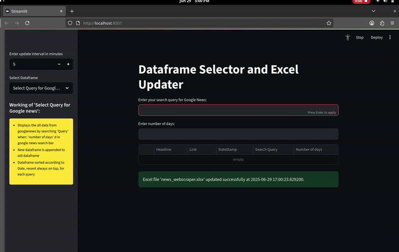
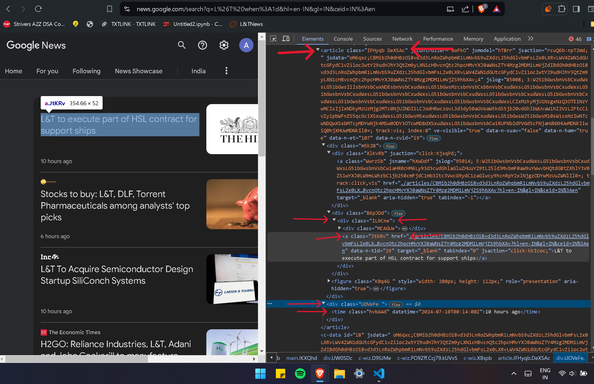
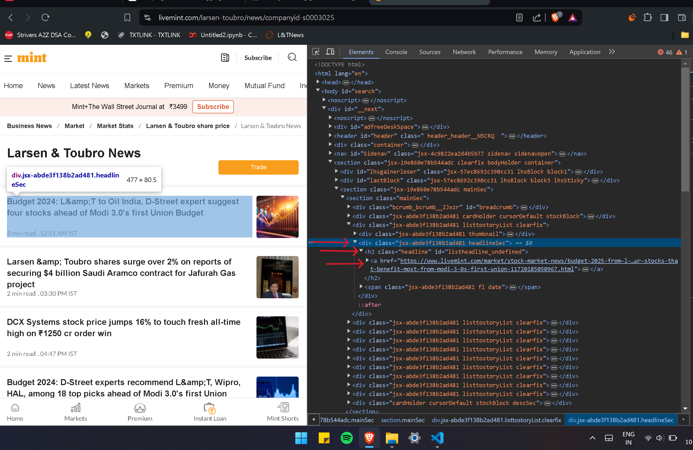
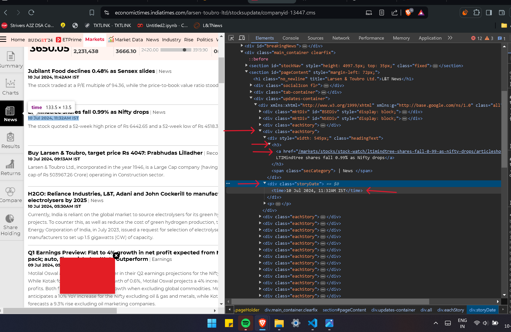
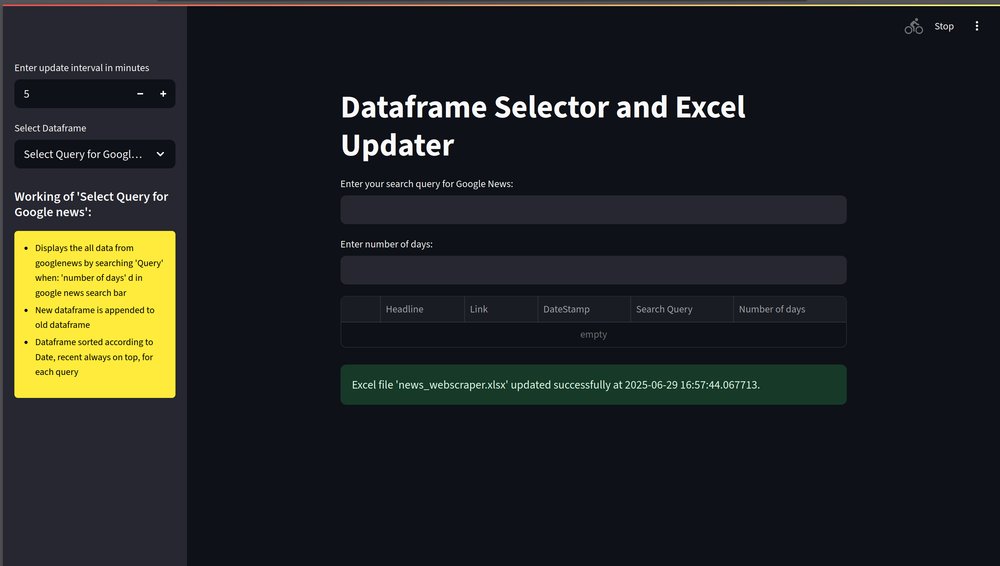
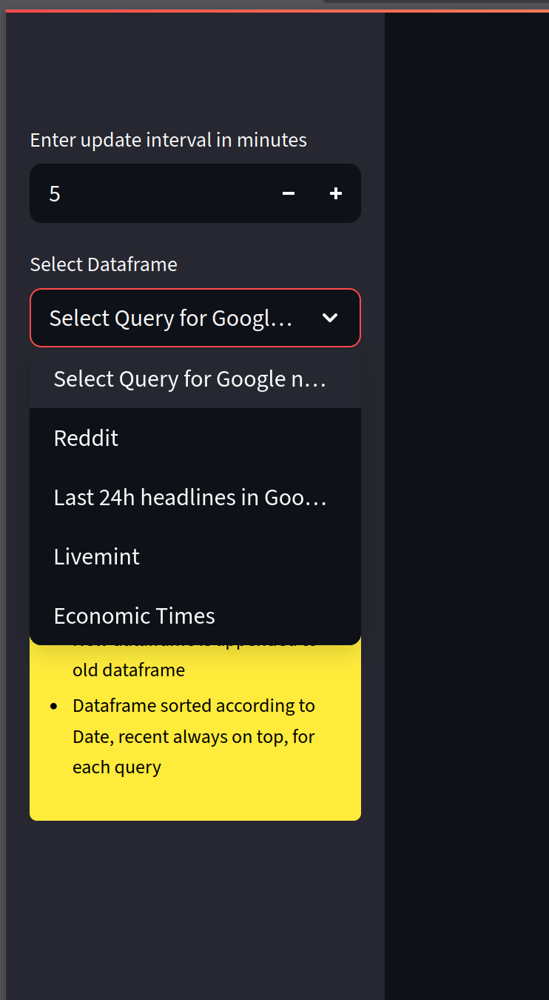

# News Web Scraper

A comprehensive web scraping application built with Streamlit that collects news from multiple sources including Livemint, Economic Times, Google News, and Reddit. The application provides a user-friendly web interface for scraping, viewing, and exporting news data to Excel format.

## 🌟 Features

- **Multi-Source News Scraping**: Collect news from multiple sources simultaneously
- **Real-Time Web Interface**: Beautiful Streamlit-based UI with interactive controls
- **Excel Export**: Automatically save scraped data to Excel files with multiple sheets
- **Scheduled Updates**: Set custom intervals for automatic data collection
- **Duplicate Prevention**: Smart deduplication to avoid storing duplicate articles
- **Comprehensive Logging**: Detailed logging for monitoring and debugging

## 📰 Supported News Sources

### 1. **Livemint**
- Scrapes news about L&T, LTTS, and LTIMindtree companies
- Real-time updates with recent news on top
- Automatic duplicate detection

### 2. **Economic Times**
- Fetches L&T Ltd news from Economic Times
- Configurable update intervals
- Sorted by date with recent news first

### 3. **Google News - Last 24h**
- Gets recent news about Larsen and Toubro from the last 24 hours
- Searches for "Larsen and Toubro when:1d" on Google News
- Continuous monitoring for new articles

### 4. **Google News - Custom Query**
- Custom search queries with specified time periods
- Dynamic search functionality
- Example: Search for "AI technology when:7d" for AI news from last 7 days

### 5. **Reddit**
- Search for keywords in specified subreddits using PRAW API
- Real-time post monitoring
- Configurable subreddit and keyword parameters

## 👀 Preview

### Demo Gif


### Screenshots

<p float="left">
  
  
  
  
  
</p>


## 🚀 Quick Start

### Prerequisites

- Python 3.8 or higher
- pip (Python package installer)

### Installation

1. **Clone the repository**
   ```bash
   git clone <your-repo-url>
   cd webscraping
   ```

2. **Install dependencies**
   ```bash
   pip install -r requirements.txt
   ```

3. **Set up environment variables**
   ```bash
   cp .env.example .env
   # Edit .env file with your API credentials
   ```

4. **Run the application**
   ```bash
   streamlit run main.py
   ```

5. **Access the web interface**
   - Open your browser and go to `http://localhost:8501`
   - Use the sidebar to select news sources and configure settings

## ⚙️ Configuration

### Environment Variables (.env file)

Create a `.env` file in the project root with the following variables:

```env
# Reddit API Credentials
REDDIT_CLIENT_ID=your_reddit_client_id
REDDIT_CLIENT_SECRET=your_reddit_client_secret
REDDIT_USER_AGENT=your_app_name (by your_username)

# Add other API credentials as needed
# GOOGLE_API_KEY=your_google_api_key
# TWITTER_API_KEY=your_twitter_api_key
```

### Configuration File (config.ini)

The `config.ini` file contains:
- Excel file path settings
- CSS selectors for web scraping
- Base URLs for different news sources
- Scraping parameters

## 📊 Usage

### Web Interface

1. **Select News Source**: Use the sidebar to choose which news source to scrape
2. **Configure Settings**:
   - Set update interval in minutes
   - For Google News Query: Enter search terms and number of days
   - For Reddit: Enter keywords and subreddit names
3. **View Results**: Scraped data appears in a table format
4. **Automatic Saving**: Data is automatically saved to Excel with separate sheets

### Features

- **Real-time Data**: View scraped data immediately in the web interface
- **Excel Export**: Data is automatically saved to `news_webscraper.xlsx`
- **Multiple Sheets**: Each news source gets its own Excel sheet
- **Scheduled Updates**: Set intervals for automatic data collection
- **Duplicate Prevention**: Avoid storing duplicate articles

## 📁 Project Structure

```
webscraping/
├── main.py                 # Main Streamlit application
├── config.ini             # Configuration settings
├── .env                   # Environment variables (not in git)
├── requirements.txt       # Python dependencies
├── README.md             # This file
├── livemint.py           # Livemint scraper
├── economictimes.py      # Economic Times scraper
├── googlenews_last_24h.py # Google News 24h scraper
├── googlenews_queried.py # Google News custom query scraper
├── reddit_queried.py     # Reddit scraper
├── news_webscraper.xlsx  # Output Excel file
├── app.log              # Application logs
└── Tutorial Pictures/   # Screenshots and documentation
```

## 🔧 API Setup

### Reddit API (PRAW)

1. Go to [Reddit Apps](https://www.reddit.com/prefs/apps)
2. Click "Create App" or "Create Another App"
3. Fill in the details:
   - **Name**: Your app name
   - **Type**: Script
   - **Description**: Brief description
   - **About URL**: Can be left blank
   - **Redirect URI**: `http://localhost:8501`
4. Copy the client ID and client secret to your `.env` file

## 📋 Requirements

Create a `requirements.txt` file with the following dependencies:

```
streamlit>=1.46.0
pandas>=2.3.0
openpyxl>=3.1.0
schedule>=1.2.0
requests>=2.32.0
beautifulsoup4>=4.13.0
praw>=7.8.0
python-dotenv>=1.1.0
```

## 🛠️ Development

### Adding New News Sources

1. Create a new Python file (e.g., `newsource.py`)
2. Implement scraping functions following the existing pattern
3. Add configuration to `config.ini`
4. Import and integrate into `main.py`

### Customizing Scraping Logic

- Modify CSS selectors in `config.ini`
- Update base URLs for different news sources
- Adjust scraping parameters as needed

## 📝 Logging

The application logs all activities to `app.log`:
- Scraping operations
- Error messages
- Success confirmations
- API interactions

## 🔒 Security

- **API Credentials**: Stored in `.env` file (not committed to git)
- **Configuration**: Non-sensitive settings in `config.ini`
- **Logs**: Application logs for debugging (no sensitive data)

## 🚨 Troubleshooting

### Common Issues

1. **Config File Not Found**: Ensure `config.ini` is in the project root
2. **API Errors**: Check your `.env` file for correct credentials
3. **Permission Errors**: Ensure write permissions for Excel file creation
4. **Network Issues**: Check internet connection for web scraping

### Debug Mode

Enable debug logging by modifying the logging level in the code:
```python
logging.basicConfig(level=logging.DEBUG)
```

## 📄 License

This project is licensed under the MIT License - see the LICENSE file for details.

## 🤝 Contributing

1. Fork the repository
2. Create a feature branch
3. Make your changes
4. Add tests if applicable
5. Submit a pull request

## 📞 Support

For issues and questions:
- Check the logs in `app.log`
- Review the configuration files
- Open an issue on GitHub

## 🔄 Updates

The application automatically:
- Checks for new articles at specified intervals
- Appends new data to existing Excel files
- Maintains data integrity with duplicate prevention
- Logs all operations for monitoring

---

**Note**: This application is for educational and research purposes. Please respect the terms of service of the websites being scraped and use responsibly. 
=======
# WebScraper
This is a WebScraping Project made for Larsen and Toubro LTD, which scarpes real time news from news websites like GoogleNews, Livemint, EconomicTimes etc and runs a cronjob every "x" minutes as specified by the user 
>>>>>>> 1e2c8b76114b1faa53a772a4827bb1f0588bfdc4
